# To-Do App — Software Architecture

This document provides architecture diagrams and explanations for the To-Do App, a full-stack Express (Node.js + TypeScript) + React task-management application. Diagrams are based on the OpenAPI specification and business requirements.

---

## 1. Sequence Diagrams

Sequence diagrams illustrate the flow of requests across actors, frontend, backend layers (controllers, services, repositories), and the database for each major API operation.

### 1.1 Authentication — Login

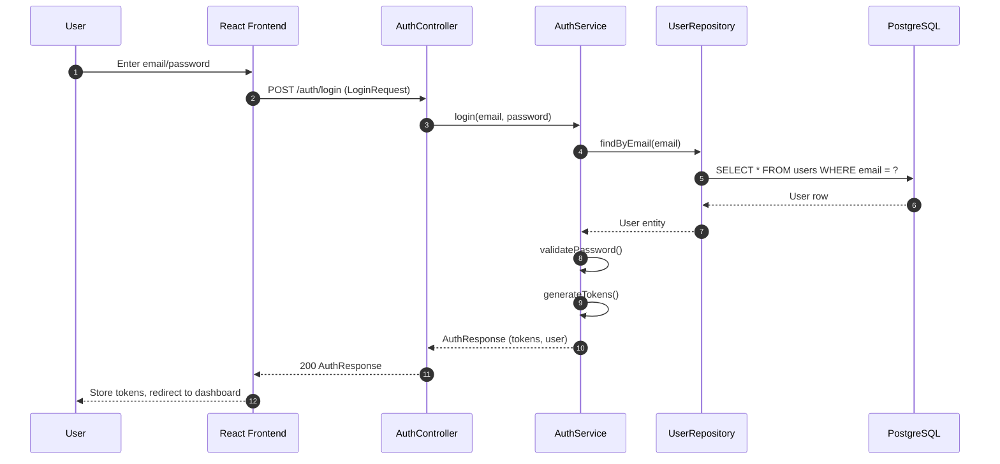

**Explanation:** The user submits credentials via the React login form. The request flows through the AuthController to AuthService, which validates credentials via UserRepository and the database. On success, AuthService generates JWT tokens and returns an AuthResponse. The frontend stores tokens and redirects the user.

---

### 1.2 Tasks — Create Task

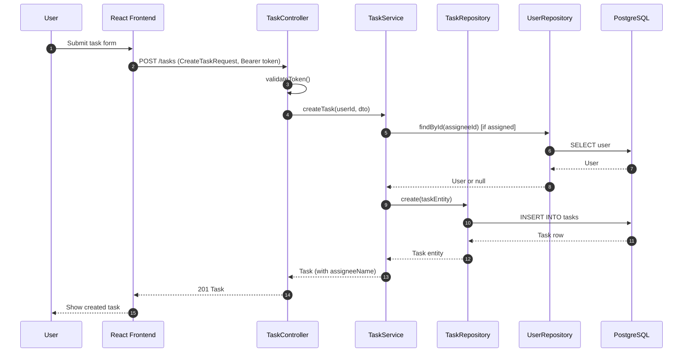

**Explanation:** An authenticated user creates a task. The TaskController validates the JWT and delegates to TaskService. The service optionally validates the assignee via UserRepository, then persists the task via TaskRepository. The created task (with resolved assignee name) is returned to the frontend.

---

### 1.3 Tasks — List Tasks

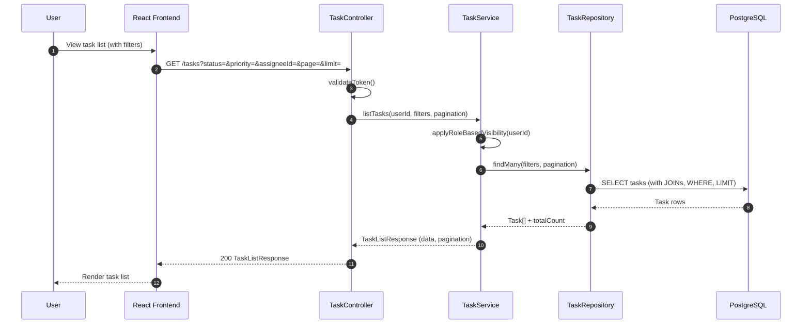

**Explanation:** The user requests a paginated, filtered list of tasks. TaskService applies role-based visibility (users see own tasks; managers see team tasks). TaskRepository executes the query with filters and pagination. The response includes task data and pagination metadata.

---

### 1.4 Tasks — Get Task by ID

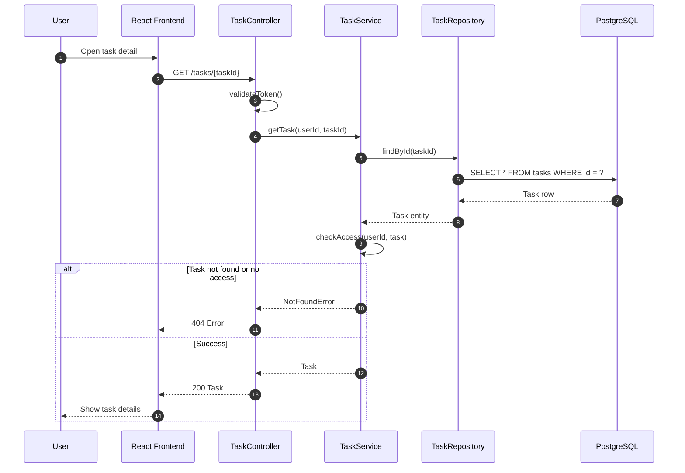

**Explanation:** The user requests a single task by ID. TaskService fetches the task and enforces access control (ownership or manager visibility). If the task is not found or access is denied, a 404 is returned.

---

### 1.5 Tasks — Update Task (PUT)

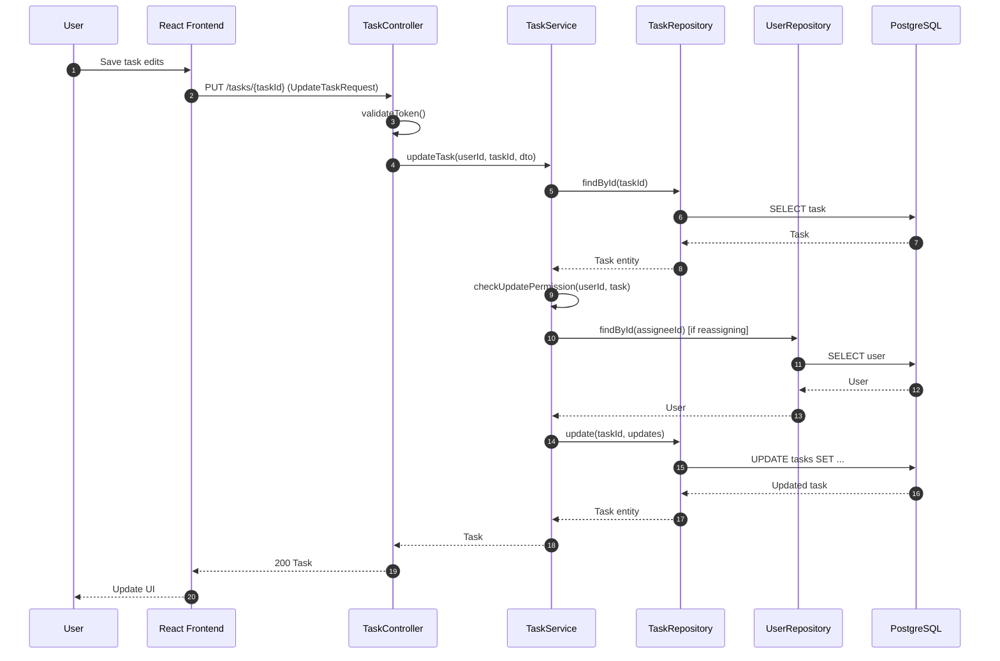

**Explanation:** Full update of a task. TaskService verifies update permission (owner or manager). If reassigning, it validates the new assignee. The task is updated in the database and the updated entity is returned.

---

### 1.6 Tasks — Delete Task

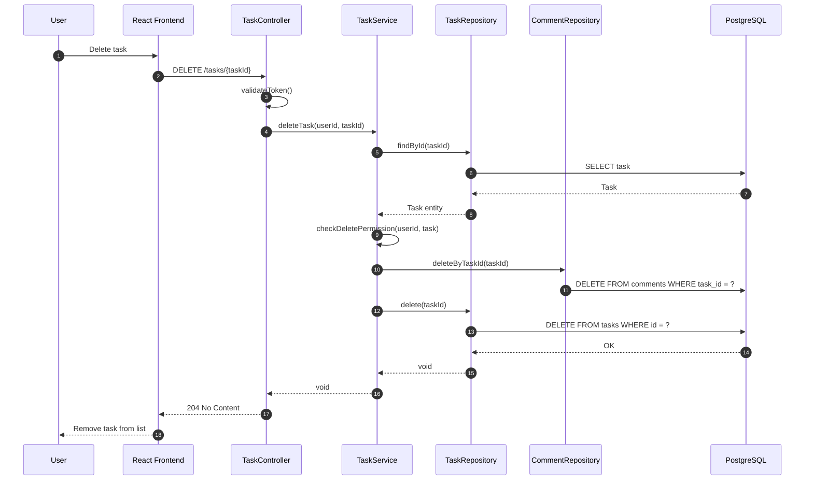

**Explanation:** Deleting a task requires permission check. Comments are deleted first (or via cascade), then the task. The API returns 204 No Content on success.

---

### 1.7 Assignments — Assign Task

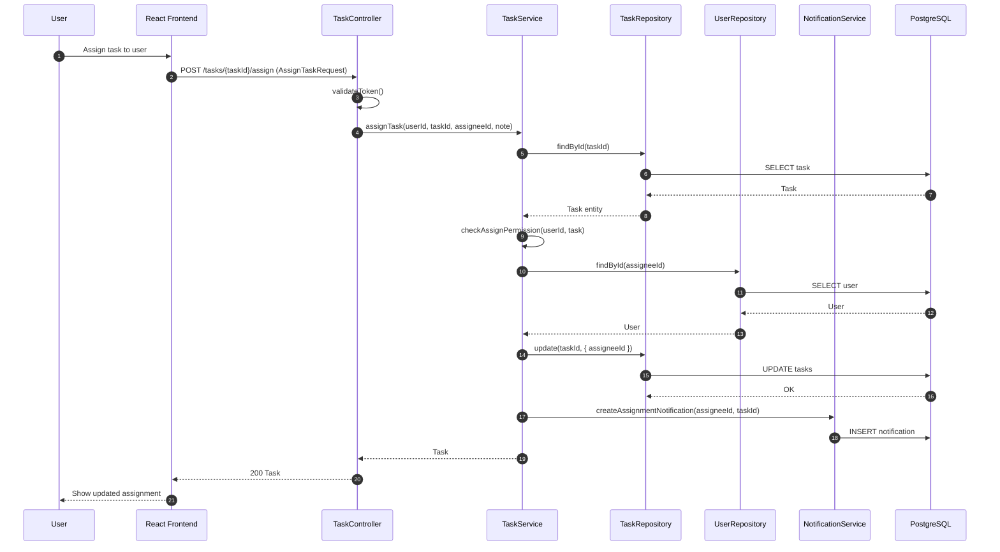

**Explanation:** A manager (or authorized user) assigns or reassigns a task. TaskService validates the assignee exists and the requester has permission. After updating the task, an assignment notification is created for the new assignee.

---

### 1.8 Comments — Add Comment

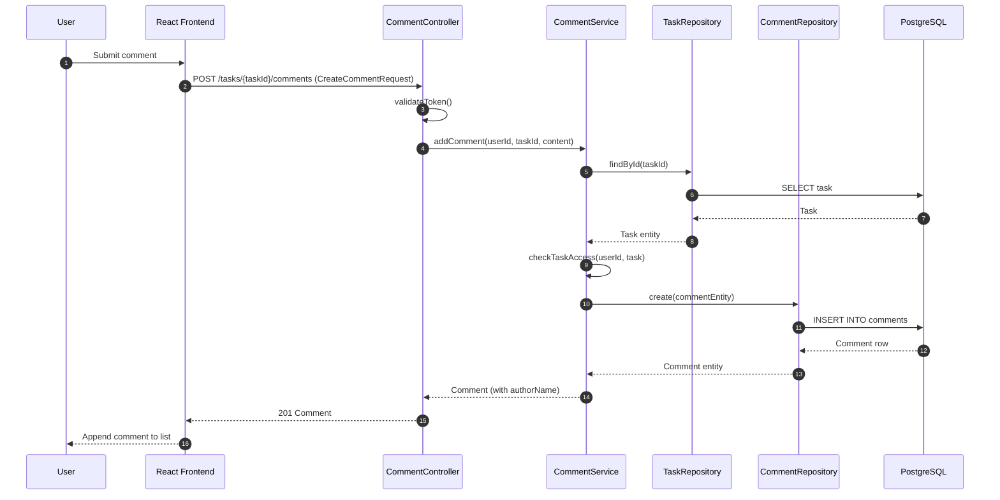

**Explanation:** The user adds a comment to a task. CommentService verifies the task exists and the user has access. The comment is persisted with the author ID; the response includes the resolved author name.

---

### 1.9 Reports — Productivity Metrics

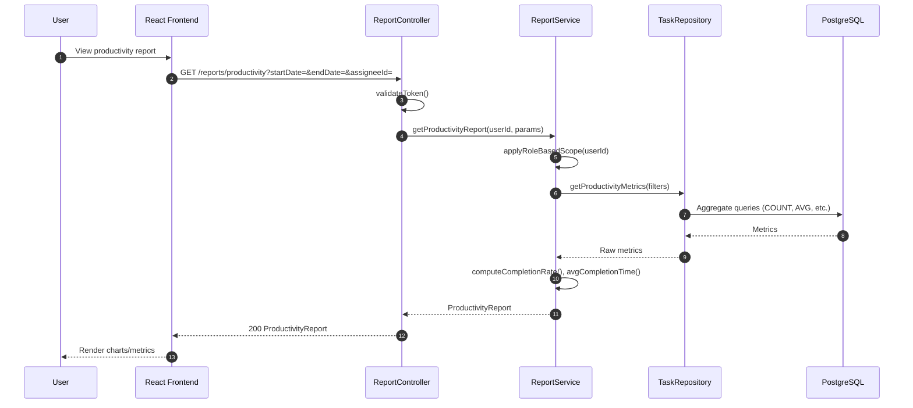

**Explanation:** The productivity report aggregates task metrics (total, completed, overdue, completion rate, average completion time). ReportService applies role-based scope (managers see team; admins see all). TaskRepository executes aggregate queries; ReportService computes derived metrics.

---

## 2. Class Diagrams

Class diagrams show entities, DTOs, services, controllers, and their relationships (aggregation, composition, inheritance).

### 2.1 Domain Entities and DTOs

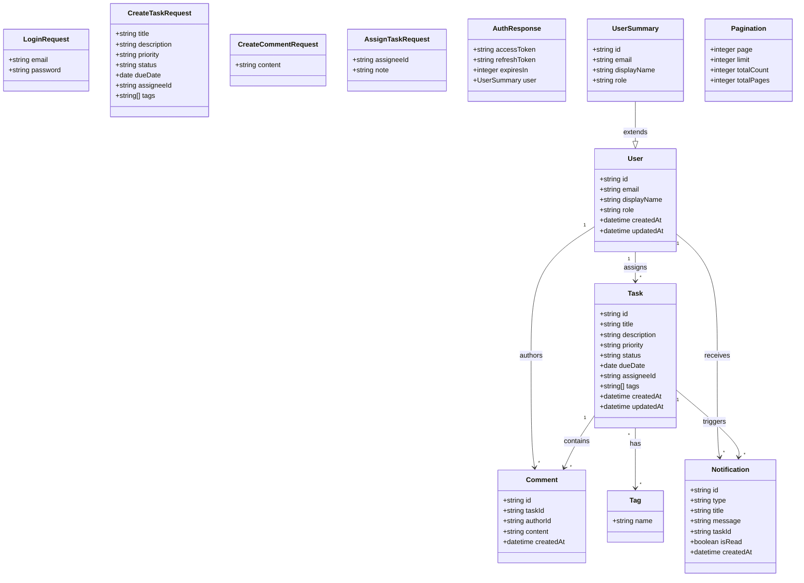

**Explanation:** Core domain entities are `User`, `Task`, `Comment`, `Notification`, and `Tag`. DTOs (`LoginRequest`, `CreateTaskRequest`, etc.) represent API request/response shapes. `UserSummary` extends `User` for auth responses. Tasks have many comments (composition) and many tags (aggregation). Users assign tasks, author comments, and receive notifications.

---

### 2.2 Controllers, Services, and Repositories

```mermaid
classDiagram
    class AuthController {
        +login(req, res)
        +ssoCallback(req, res)
        +refreshToken(req, res)
    }

    class TaskController {
        +listTasks(req, res)
        +createTask(req, res)
        +getTask(req, res)
        +updateTask(req, res)
        +patchTask(req, res)
        +deleteTask(req, res)
        +assignTask(req, res)
    }

    class CommentController {
        +listComments(req, res)
        +addComment(req, res)
        +deleteComment(req, res)
    }

    class ReportController {
        +getCompletedReport(req, res)
        +getOverdueReport(req, res)
        +getProductivityReport(req, res)
    }

    class NotificationController {
        +listNotifications(req, res)
        +markAsRead(req, res)
    }

    class UserController {
        +listUsers(req, res)
    }

    class AuthService {
        -UserRepository userRepo
        +login(email, password) AuthResponse
        +validateSsoToken(token) AuthResponse
        +refreshToken(refreshToken) AuthResponse
    }

    class TaskService {
        -TaskRepository taskRepo
        -UserRepository userRepo
        +listTasks(userId, filters) TaskListResponse
        +createTask(userId, dto) Task
        +getTask(userId, taskId) Task
        +updateTask(userId, taskId, dto) Task
        +deleteTask(userId, taskId) void
        +assignTask(userId, taskId, assigneeId, note) Task
    }

    class CommentService {
        -CommentRepository commentRepo
        -TaskRepository taskRepo
        +listComments(taskId, pagination) CommentListResponse
        +addComment(userId, taskId, content) Comment
        +deleteComment(userId, taskId, commentId) void
    }

    class ReportService {
        -TaskRepository taskRepo
        +getCompletedReport(userId, params) CompletedTasksReport
        +getOverdueReport(userId, params) OverdueTasksReport
        +getProductivityReport(userId, params) ProductivityReport
    }

    class NotificationService {
        -NotificationRepository notificationRepo
        +listNotifications(userId, params) NotificationListResponse
        +markAsRead(userId, notificationId) Notification
    }

    class UserService {
        -UserRepository userRepo
        +listUsers(userId, params) UserListResponse
    }

    class TaskRepository {
        +findById(id) Task
        +findMany(filters, pagination) Task[]
        +create(task) Task
        +update(id, updates) Task
        +delete(id) void
    }

    class UserRepository {
        +findById(id) User
        +findByEmail(email) User
        +findMany(params) User[]
    }

    class CommentRepository {
        +findByTaskId(taskId, pagination) Comment[]
        +create(comment) Comment
        +delete(id) void
    }

    class NotificationRepository {
        +findByUserId(userId, params) Notification[]
        +updateRead(id) Notification
    }

    %% Controller -> Service
    AuthController --> AuthService : uses
    TaskController --> TaskService : uses
    CommentController --> CommentService : uses
    ReportController --> ReportService : uses
    NotificationController --> NotificationService : uses
    UserController --> UserService : uses

    %% Service -> Repository
    AuthService --> UserRepository : uses
    TaskService --> TaskRepository : uses
    TaskService --> UserRepository : uses
    CommentService --> CommentRepository : uses
    CommentService --> TaskRepository : uses
    ReportService --> TaskRepository : uses
    NotificationService --> NotificationRepository : uses
    UserService --> UserRepository : uses
```

**Explanation:** Controllers handle HTTP concerns and delegate to services. Services encapsulate business logic and use repositories for data access. Each service depends on one or more repositories. The structure follows a layered architecture with clear separation of concerns.

---

## 3. Architecture Diagram

Full-stack architecture showing layers, components, and communication flow.

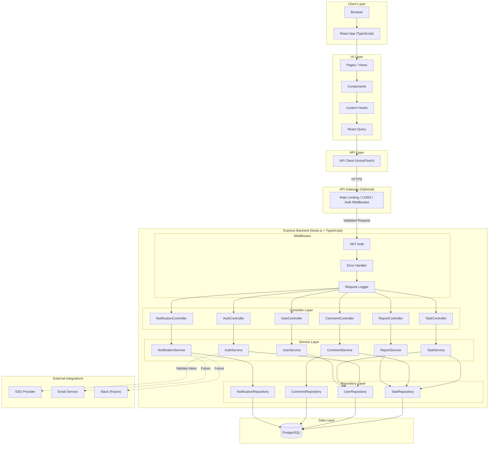

**Explanation:** The architecture is a classic layered full-stack design:

- **Client Layer:** Browser runs the React SPA.
- **UI Layer:** React pages and components use custom hooks and React Query for data fetching and caching.
- **API Layer:** An API client (e.g., Axios) sends HTTP requests to the backend.
- **API Gateway (Optional):** Handles rate limiting, CORS, and initial auth checks before requests reach Express.
- **Controller Layer:** Express controllers receive requests, validate input, and delegate to services.
- **Middleware:** JWT auth, centralized error handling, and structured logging.
- **Service Layer:** Business logic; services orchestrate repositories and external integrations.
- **Repository Layer:** Data access abstraction; repositories perform CRUD against the database.
- **Data Layer:** PostgreSQL for persistence (SQLite for local dev per BRD).
- **External Integrations:** SSO for authentication; email and Slack for future notifications.

---

### 3.1 Cloud Architecture Diagram

Cloud deployment view showing how the To-Do App runs on Kubernetes within a cloud provider (AWS, Azure, or GCP). Environments: dev, staging, prod.

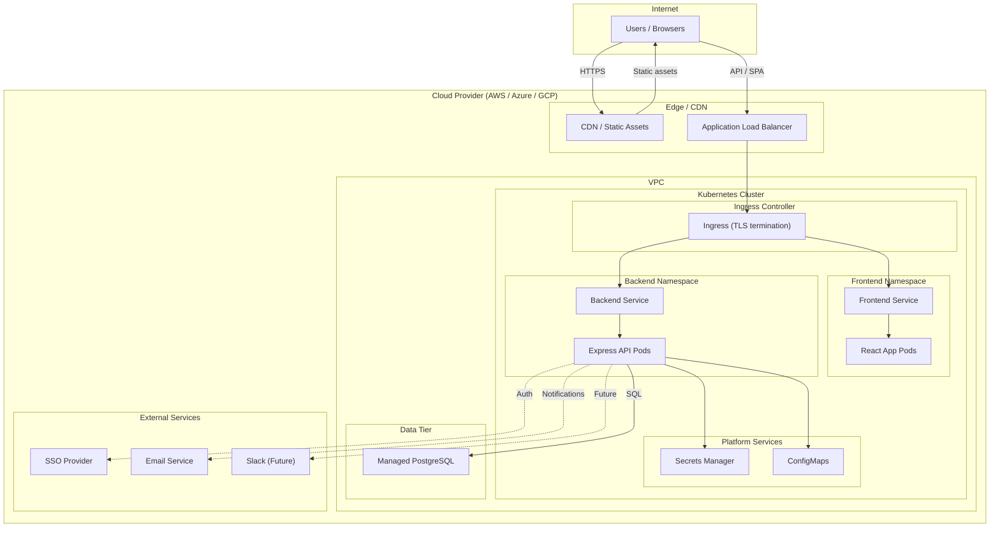

**Cloud deployment summary:**

| Component | Cloud Implementation |
|-----------|----------------------|
| **Frontend** | React SPA served from CDN or via Ingress; runs in K8s pods |
| **Backend** | Express API in K8s Deployment; scaled via replicas (dev: 1, staging: 2, prod: 3+) |
| **Database** | Managed PostgreSQL (RDS, Azure Database, Cloud SQL) |
| **Secrets** | K8s Secrets or cloud Secrets Manager (DB credentials, JWT keys) |
| **Environments** | Namespaces: `app-dev`, `app-staging`, `app-prod` |
| **Ingress** | TLS termination, routing to frontend/backend services |

---

## 4. Data Flow Summary

| Operation        | Frontend → Controller → Service → Repository → DB |
|-----------------|---------------------------------------------------|
| Login           | AuthController → AuthService → UserRepository    |
| Create Task     | TaskController → TaskService → TaskRepository    |
| List Tasks      | TaskController → TaskService → TaskRepository    |
| Assign Task     | TaskController → TaskService → TaskRepository + NotificationService |
| Add Comment     | CommentController → CommentService → CommentRepository |
| Get Reports     | ReportController → ReportService → TaskRepository |

---

## 5. Technology Stack

| Layer        | Technology                          |
|-------------|-------------------------------------|
| Frontend    | React, TypeScript, React Query      |
| Backend     | Express, Node.js, TypeScript        |
| Database    | PostgreSQL (prod), SQLite (dev)     |
| Auth        | JWT, SSO (optional)                 |
| API Spec    | OpenAPI 3.0                         |

---

*Generated from OpenAPI specification and BRD-TodoApp.md. Diagrams use Mermaid syntax and can be rendered in GitHub, GitLab, or any Mermaid-compatible viewer.*
